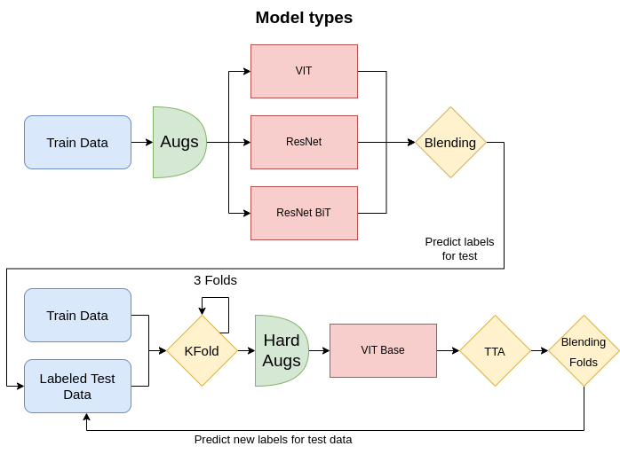

# Masters of Arts: ML Challenge, Mister MISISter's 6/52 place solution

## Solution Architecture

---
## Blending
### Optimizers
 - Adam
 - MADGRAD
 - QHAdam
### Losses
 - CrossEntropyLoss
 - FocalLoss with class weights
### Schedulers
 - One Cycle Scheduler 
### Tricks
 - LabelSmoothing
 - Mixup
---
## Final Model
### Optimizers
 - QHAdam
### Losses
 - CrossEntropyLoss
### Schedulers
 - One Cycle Scheduler 
### Tricks
 - Test Time Augmentation
 - Blending Folds
 - Hard Augmentations for better generalization on unseen data
